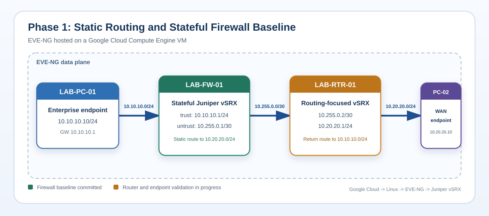

# Cloud-Hosted Juniper Enterprise/WAN Lab

This project is a Juniper networking lab built with **EVE-NG on Google Cloud Platform**. I deployed the EVE-NG environment on a Compute Engine VM, administered the Linux host over SSH, accessed the platform through its HTML5 interface, and used Telnet for Juniper vSRX console access.

The current four-node build models an enterprise endpoint crossing a stateful security boundary and an upstream router to reach a WAN-side endpoint. It gives me an environment where I can configure, break, validate, and document the networking concepts I encounter in enterprise network operations.

## Why I Built It in Google Cloud

The original lab ran through nested virtualization on a 16 GB Mac:

```text
macOS -> VMware Fusion -> EVE-NG -> Juniper vSRX nodes
```

Running both vSRX appliances created resource pressure and made it difficult to distinguish a network fault from a virtualization fault. I used Google Cloud trial credit to move the compute workload into a larger remote VM rather than delay the project until I could purchase more hardware.

Google Cloud supplies the compute platform. Linux hosts EVE-NG. EVE-NG hosts the virtual network appliances and topology.

```text
Remote workstation
  |-- SSH ----------> Linux host on GCP
  |-- HTTPS/HTML5 --> EVE-NG web interface
                         |-- Telnet console --> LAB-FW-01
                         `-- Telnet console --> LAB-RTR-01
```

## Current Phase 1 Topology



```text
LAB-PC-01 -> LAB-FW-01 -> LAB-RTR-01 -> LAB-PC-02
```

| Device | Role | Addressing |
|---|---|---|
| `LAB-PC-01` | Enterprise endpoint | `10.10.10.10/24`, gateway `10.10.10.1` |
| `LAB-FW-01` | Stateful Juniper vSRX firewall | `10.10.10.1/24`, `10.255.0.1/30` |
| `LAB-RTR-01` | Routing-focused Juniper vSRX | `10.255.0.2/30`, `10.20.20.1/24` |
| `LAB-PC-02` | WAN-side endpoint | `10.20.20.10/24`, gateway `10.20.20.1` |

The `/24` networks provide endpoint LANs. The `/30` is a two-address transit network between the firewall and router.

## Current Status

**Phase 1 - Core Connectivity: In Progress**

The cloud platform, vSRX deployment, and firewall baseline are complete. The firewall currently has:

- Operational interfaces at `10.10.10.1/24` and `10.255.0.1/30`
- `ge-0/0/0.0` assigned to the `trust` zone
- `ge-0/0/1.0` assigned to the `untrust` zone
- Host-inbound ICMP enabled for local interface testing
- An active static route to `10.20.20.0/24` through `10.255.0.2`
- The factory-broad `trust -> untrust` permit removed
- A validated and committed candidate configuration

The missing transit policy is intentional. It creates a controlled checkpoint where routing exists but security policy does not yet authorize the flow. Phase 1 will demonstrate failure before the policy, success after a narrow ICMP policy, and the SRX stateful session created by the permitted traffic.

See the [Phase 1 build record](documentation/phase-1/README.md) for the completed steps, remaining work, and acceptance criteria.

## What the Current Evidence Demonstrates

### Cloud and platform administration

- Google Cloud Compute Engine provisioning
- Nested virtualization and KVM validation
- Linux CLI and SSH administration
- EVE-NG installation and browser-based access
- Juniper appliance deployment and Telnet console access

### Networking and security evidence completed

- Phase 1 address and subnet design for two `/24` endpoint LANs and a `/30` transit link
- Operational `LAB-FW-01` interfaces with the planned IPv4 addresses
- An active static route on `LAB-FW-01` toward `10.20.20.0/24` through `10.255.0.2`
- Route-table and next-hop interpretation without treating route existence as proof of reachability
- `LAB-FW-01` trust and untrust zone assignment
- Host-inbound ICMP versus transit-policy authorization
- Deliberate removal of the broad transit permit to create a controlled policy-test checkpoint

### Change control and troubleshooting evidence completed

- Junos candidate configuration
- `show | compare` review
- `commit check` validation
- Descriptive commit comments
- One-command, one-question troubleshooting
- Explicit documentation of what an output proves and what it does not prove

## Remaining Phase 1 Acceptance Tests

- Configure and validate both `LAB-RTR-01` interfaces and its static return route.
- Configure both endpoints and prove local-gateway reachability.
- Record the expected transit failure while no security policy authorizes the flow.
- Add a narrow `trust -> untrust` ICMP policy and prove end-to-end success.
- Inspect the SRX session table to prove stateful return handling.
- Prove WAN-initiated traffic remains denied without a reverse policy.
- Export sanitized final device configurations and remaining command evidence.
## Phase 1 Validation Method

The complete Phase 1 build will be validated in layers. Only results linked under Current Status are claimed as complete:

1. Confirm each interface is operational and correctly addressed.
2. Confirm directly connected neighbors can communicate.
3. Confirm both devices have routes to the remote endpoint network.
4. Confirm the SRX classifies the path as `trust -> untrust`.
5. Prove transit traffic fails without an authorizing policy.
6. Add and commit a narrow ICMP policy.
7. Prove end-to-end traffic succeeds.
8. Inspect the SRX session table to prove stateful return handling.
9. Prove traffic initiated from `untrust` remains denied without a reverse policy.

This separates five questions that are often incorrectly collapsed into one:

```text
Is the link operational?
Is the address correct?
Does a route exist?
Does policy authorize the flow?
Did the firewall create a session?
```

## Repository Structure

| Path | Purpose |
|---|---|
| `topology/` | EVE-NG export and Phase 1 architecture diagram |
| `documentation/` | Addressing, roles, interface maps, deployment, and phase records |
| `validation-outputs/` | Sanitized command output and traffic-test evidence |
| `troubleshooting/` | Fault records, root-cause analysis, and lessons learned |
| `ROADMAP.md` | Clearly separated future expansion after Phase 1 |

Placeholder-only directories are excluded from the tree. `device-configs/` will be added after sanitized configurations are exported; switching, automation, and server artifacts will be added only when their phases are implemented and validated.

## Documentation

- [Phase 1 Build Record](documentation/phase-1/README.md)
- [Google Cloud EVE-NG Deployment](documentation/phase-1/gcp-eve-ng-deployment.md)
- [Device Roles](documentation/device-roles.md)
- [Interface and Circuit Map](documentation/interface-circuit-map.md)
- [IP Addressing Plan](documentation/ip-addressing-plan.md)
- [Hostname Convention](documentation/hostname-convention.md)
- [Local vSRX Resource Exhaustion](troubleshooting/local-vsrx-resource-exhaustion.md)
- [GCP Host Validation](validation-outputs/phase-1/gcp-host-validation.txt)
- [Future Development](ROADMAP.md)

## Future Development

Dynamic routing, switching, automation, and telemetry are not part of the completed Phase 1 claim. They are sequenced in [ROADMAP.md](ROADMAP.md) and will move into the main documentation only after configuration and validation evidence exists.

## Repository Safety

Licensed network operating-system images are not stored here. Published evidence must not contain passwords, private keys, tokens, cloud project identifiers, billing information, or public addresses that should remain private.
