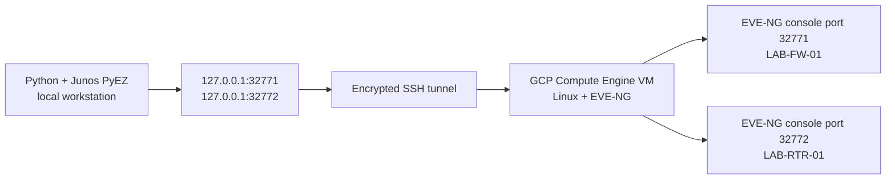

# Junos PyEZ Facts Retrieval Through the EVE-NG Console

This milestone proves that one Python program can reach both live Junos vSRX appliances in the cloud-hosted EVE-NG lab and retrieve structured, read-only device facts.

The method used here is intentionally precise:

- SSH protects the path from the workstation to the Google Cloud VM.
- SSH local port forwarding exposes each remote EVE-NG console port only on the workstation's loopback interface.
- PyEZ connects to each forwarded port in `telnet` mode and authenticates to Junos at the console prompt.
- The script reads facts; it does not change device configuration.

This is **not NETCONF over SSH**. A future milestone will enable `system services netconf ssh` and connect to a reachable Junos management address, normally on TCP port 830.

## Connection path



See the standalone [connection diagram](../diagrams/pyez-console-access.md).

## Prerequisites

- The GCP VM and both EVE-NG vSRX nodes are running.
- The local Google Cloud CLI is authenticated and can SSH to the VM.
- Python 3 and a virtual environment are available locally.
- Junos usernames and passwords are known; credentials are never stored in this repository.

Install the Python dependency:

```bash
python3 -m venv .venv
source .venv/bin/activate
python -m pip install -r automation/requirements.txt
```

## 1. Confirm the remote listeners

From an SSH session on the GCP VM, verify that EVE-NG is listening on the console ports assigned to the two nodes:

```bash
sudo ss -lntp | grep -E '32771|32772'
```

This check answers one question only: are the console sockets listening on the remote host? It does not prove that the local workstation can reach them.

## 2. Create the SSH tunnel

Run this from the local workstation and keep the session open:

```bash
gcloud compute ssh eve-ng-lab \
  --zone us-east1-c \
  -- -N \
  -L 127.0.0.1:32771:127.0.0.1:32771 \
  -L 127.0.0.1:32772:127.0.0.1:32772
```

Replace the instance name and zone if the environment changes. The public IP and cloud project ID are intentionally omitted.

Each `-L` rule means:

```text
local loopback address and port
        -> encrypted SSH session to the GCP VM
        -> loopback address and EVE-NG console port on that VM
```

Binding the local side to `127.0.0.1` prevents other machines on the local network from using the forwarded console ports.

## 3. Verify the local side of the tunnel

In a second local terminal:

```bash
nc -vz 127.0.0.1 32771
nc -vz 127.0.0.1 32772
```

Successful TCP checks prove that both local forwards are open. They do not yet prove Junos authentication or fact retrieval.

## 4. Run the collector

```bash
python automation/pull_device_facts.py
```

The script prompts once for the Junos username and password, iterates through the inventory list, opens each console session, retrieves the selected fact keys, prints the result, and closes the session through the `with Device(...)` context manager.

The `Device` arguments matter:

| Argument | Purpose |
|---|---|
| `host="127.0.0.1"` | Connects to the workstation side of the SSH tunnel. |
| `port=32771` or `32772` | Selects the EVE-NG console mapped to a specific vSRX. |
| `mode="telnet"` | Tells PyEZ that the final device access method is a Telnet-style console session. |
| `gather_facts=True` | Makes device facts available for the console connection. |
| `user` and `passwd` | Authenticates at the Junos login prompt without placing secrets in source code. |

PyEZ exposes device facts through a dictionary-like `facts` property. This collector deliberately prints only a small set of facts that can be explained and safely reviewed.

## Evidence

The [sanitized validation transcript](../validation-outputs/automation/pyez-facts-sanitized.txt) records successful retrieval from both `LAB-FW-01` and `LAB-RTR-01`. Credentials, public addresses, cloud identifiers, full serial values, and volatile uptime were removed.

## What this proves

- The workstation could reach both remote EVE-NG console sockets through one encrypted SSH session.
- The inventory mapped each local port to the intended logical device.
- PyEZ authenticated to two live Junos control planes.
- The script retrieved structured device facts and handled the devices in a repeatable loop.
- The workflow was read-only and did not push configuration.

## What this does not prove

- NETCONF reachability on TCP 830.
- Data-plane reachability between the lab endpoints.
- Configuration automation or compliance enforcement.
- Production readiness, secret management, concurrency, or retry logic.

Those are separate milestones and should receive their own configuration and validation evidence.

## References

- [Juniper: Connect to Junos devices using Junos PyEZ](https://www.juniper.net/documentation/us/en/software/junos-pyez/junos-pyez-developer/topics/topic-map/junos-pyez-connection-methods.html)
- [Juniper: Retrieve device facts using Junos PyEZ](https://www.juniper.net/documentation/us/en/software/junos-pyez/junos-pyez-developer/topics/topic-map/junos-pyez-program-device-connecting.html)
