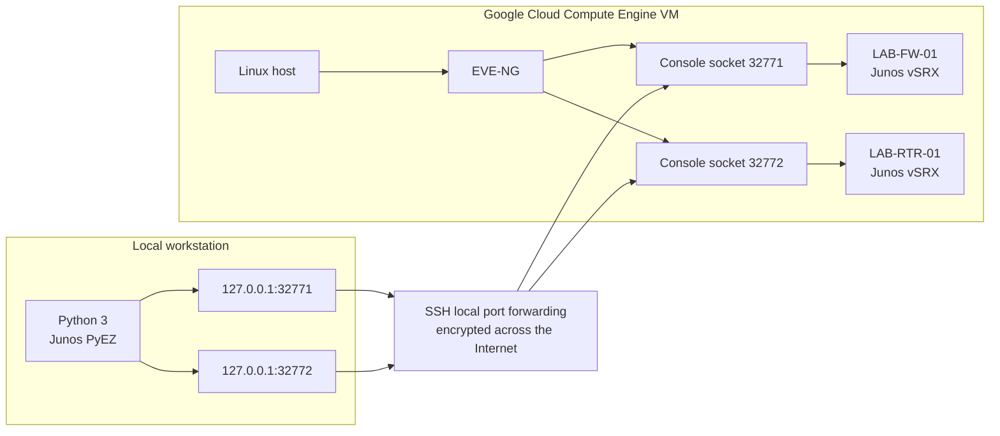

# GCP-to-EVE-NG-to-vSRX Automation Path

## Protocol boundaries

| Segment | Protocol | Meaning |
|---|---|---|
| Workstation to GCP VM | SSH | Encrypts and authenticates the remote-host connection. |
| Local ports to remote ports | SSH local forwarding | Carries the two console TCP streams through the encrypted session. |
| PyEZ to Junos console prompt | Telnet-style console mode | Logs in to Junos and retrieves facts through the forwarded EVE-NG console socket. |

The word **Telnet** describes PyEZ's device-side console mode. The Internet-facing leg is inside SSH. No public console-port address is required or documented.

This diagram describes the management path used by the Python collector. It is separate from the Phase 1 data-plane topology in `topology/phase-1-topology.svg`.
